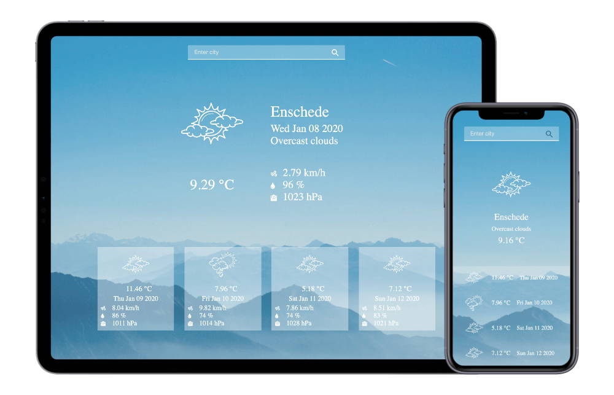

# Weather Forecast
This is an Angular application which allows you to get weather for 5 days.

  

## Features

 * Displayed weather info by city name
 
## Frameworks and Tools
 
 * TypeScript
 * Angular 8
 * SASS

## What to improve?

 * Add Unit tests
 * Add UI tests
 * Add integration with CI 
 * Move to RxJS
 * Add weather info for next five days
 * Add toggle for temperature (fahrenheit and celsius)
 * Improve error handling
 * Add animations 

## Development server

Run `ng serve` for a dev server. Navigate to `http://localhost:4200/`. The app will automatically reload if you change any of the source files.

## Code scaffolding

Run `ng generate component component-name` to generate a new component. You can also use `ng generate directive|pipe|service|class|guard|interface|enum|module`.

## Build

Run `ng build` to build the project. The build artifacts will be stored in the `dist/` directory. Use the `--prod` flag for a production build.

## Running unit tests

Run `ng test` to execute the unit tests via [Karma](https://karma-runner.github.io).

## Running end-to-end tests

Run `ng e2e` to execute the end-to-end tests via [Protractor](http://www.protractortest.org/).

## Further help

To get more help on the Angular CLI use `ng help` or go check out the [Angular CLI README](https://github.com/angular/angular-cli/blob/master/README.md).
